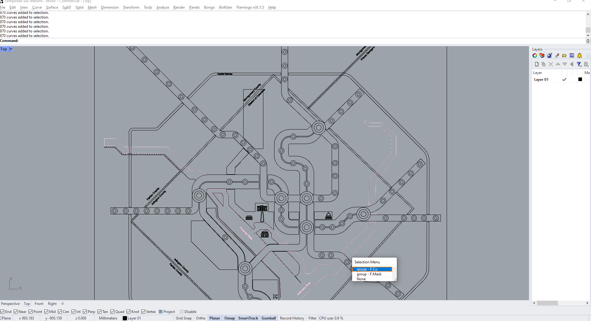
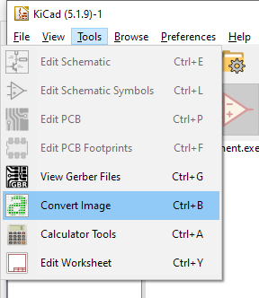
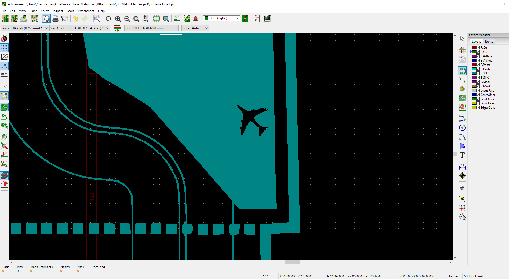
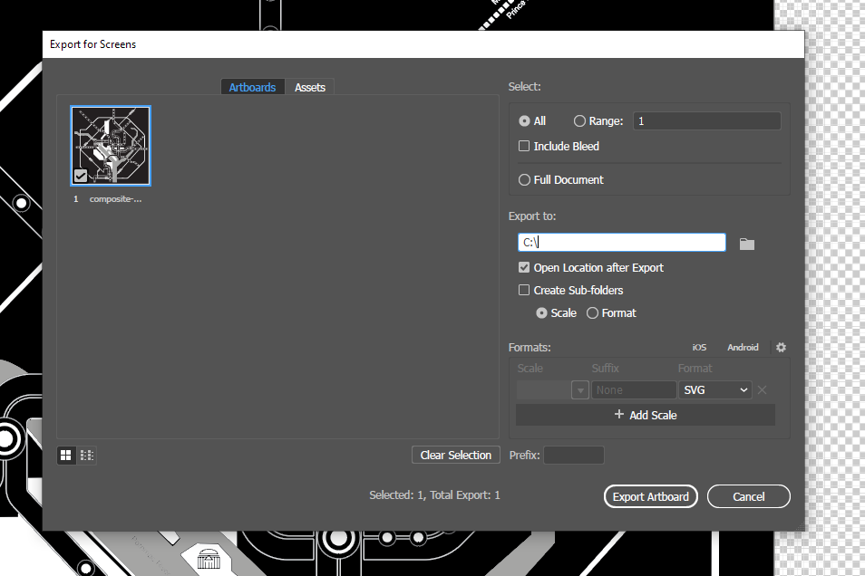
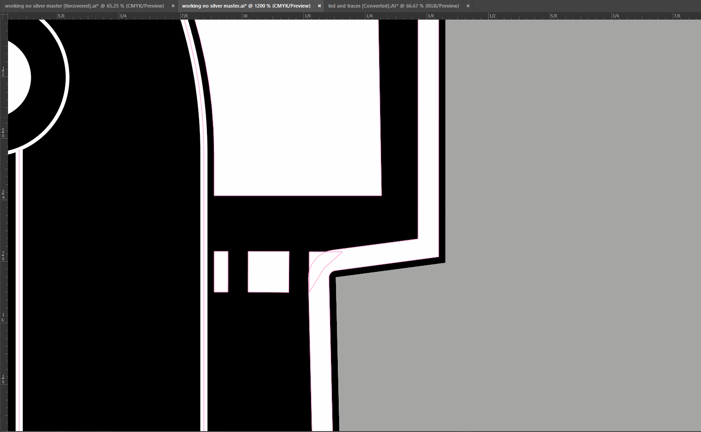
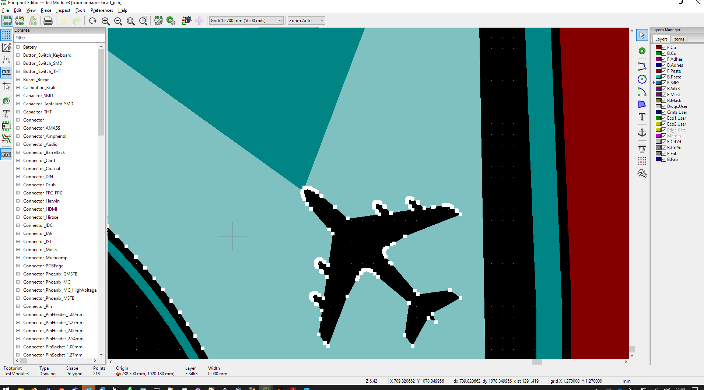
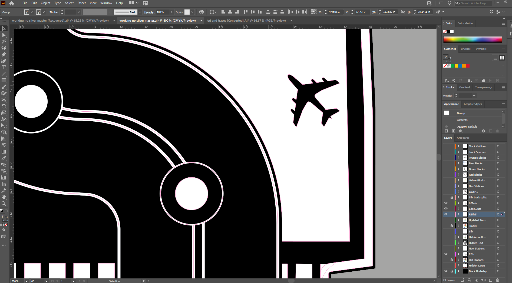
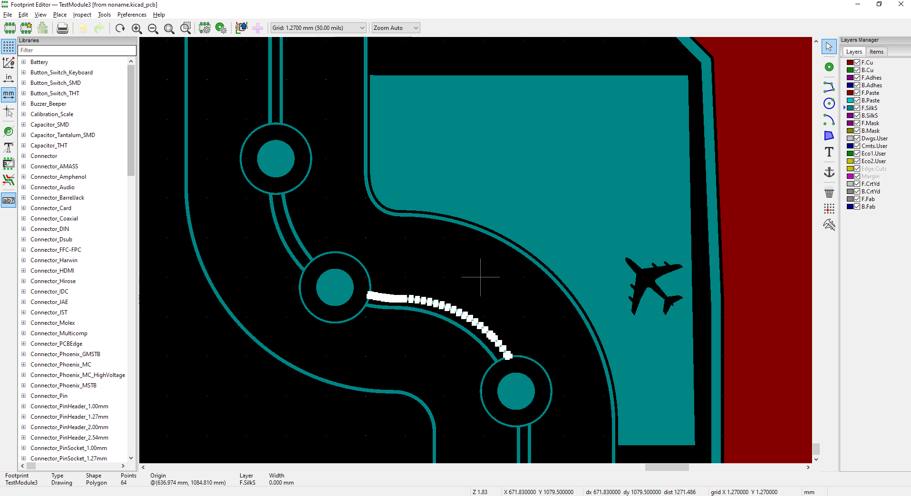

# Using Illustrator (and other vector drawing tools) with KiCad

## TL;DR
[Jump to the important bits](#gerbolyze-the-winning-solution)

## Why This Guide?
This outline is drawn from days of frustration trying to move a complicated set of vector art and traces into KiCad for final wiring and production.  

In defense of Adobe Illustrator: while it is not open source and has an associated monthly cost; it still sets the benchmark for WYSWYG vector graphics. It can read and write almost any vector file type and has numerous drawing tools that make doing deeply complex are much easier. Outside of the PCB/Open-Source Software Community Illustrator is widely used.

I wanted to do the following with my PCB:
- Plot arbitrary vector graphics on the silkscreen layer. Ideally; using native line widths rather than having to expand lines in illustrator.  
- Plot copper and soldermask to component-sized pads. This allowed me to use standard CAD tools to flow pads along splines.
- Plot exposed copper pours and soldermask as part of vector art.
- Do all of this with native vector art, without washing it through a raster first.  

**If you have significant experience or buy-in with Inkscape; I recommend the excellent [svg2shenzhen](https://github.com/badgeek/svg2shenzhen) project.**

Your mileage may vary, but I will share what did and didn't work.  

## A Bit About SVGs
SVGs are not all created equal. Illustrator and [Rhino](www.rhino3d.com) seem to be largely compatible in their handling of SVGs (although Rhino does not acknowle line width, which is odd). Inkscape very much *does NOT* treat these the same way.   
**SVGs cannot contain layers.** But instead contain groups (which can be mapped roughly from layers to groups when exporting from Rhino or Illustrator). Rhino treats these as native groups:


The group name is embedded in the SVG as the following:
```
<svg xmlns="http://www.w3.org/2000/svg" viewBox="0 0 1417.32 1417.32"><defs><style>.cls-1,.cls-5,.cls-6,.cls-7{fill:#231f20;}.cls-2{fill:#a5a4a4;}.cls-3,.cls-4{fill:#fff;}.cls-4,.cls-5{fill-rule:evenodd;}.cls-6{stroke:#231f20;}.cls-10,.cls-11,.cls-12,.cls-13,.cls-6,.cls-7,.cls-8,.cls-9{stroke-miterlimit:10;}.cls-6,.cls-7,.cls-9{stroke-width:0.75px;}.cls-10,.cls-11,.cls-12,.cls-7,.cls-8,.cls-9{stroke:#fff;}.cls-10,.cls-11,.cls-12,.cls-13,.cls-8,.cls-9{fill:none;}.cls-8{stroke-width:3px;}.cls-11{stroke-width:0.5px;}.cls-12{stroke-width:3.7px;}.cls-13{stroke:#a5a4a4;}</style></defs><g id="Black_Underlay" data-name="Black Underlay"><rect class="cls-1" width="1417.32" height="1417.32"/></g><g id="F.Cu"><polygon class="cls-2" points="136.95 478.91 118.42 478.91 84.5 445 39.28 445 39.28 475.15 84.5 475.15 114.65 505.3 136.95 505.3 136.95 478.91"/><polygon class="cls-2" points="364.76 552.62 291.78 478.91 148.88 478.91 148.88 505.3 281.42 505.3 347.31 570.74 364.76 552.62"/><path class="cls-2" d="M600.23,815.26a2.08,2.08,0,1,0-.26,2.63A1.77,1.77,0,0,0,600.23,815.26Z"/><path class="cls-2" d="M608.68,827c-.49-.34-1-.55-1.45-.08s-.21.91.18,1.29a1.42,1.42,0,0,0,2,.3l.64-.63A4.53,4.53,0,0,1,608.68,827Z"/><path class="cls-2" d=.........
```

This export was done through the below `Export for Screens` method from Adobe Illustrator. Illustrator has changed the layers to groups i.e. `<g id="F.Cu">` represents the starting tag of a new group. 

After opening an SVG that was taken from Illustrators > Inkscape > Save as a new SVG the groups are lost. While they still exist in the SVG, there seem to be no members within each group. The artifact looks the following at the very end of the SVG:
```
...........
  <g
     inkscape:label="[fixed] BG"
     inkscape:groupmode="layer"
     sodipodi:insensitive="true"
     id="g16807">
    <rect
       x="0"
       y="0"
       width="500.0"
       height="500.0"
       style="fill:#FFFFFF;fill-opacity:1;stroke:none"
       id="rect16805" />
  </g>
  <g
     inkscape:label="F.Adhes"
     inkscape:groupmode="layer"
     id="g16809" />
  <g
     inkscape:label="Edge.Cuts"
     inkscape:groupmode="layer"
     id="g16811" />
  <g
     inkscape:label="B.Cu"
     inkscape:groupmode="layer"
     id="g16813" />
  <g
     inkscape:label="B.Mask"
     inkscape:groupmode="layer"
     id="g16815" />
  <g
     inkscape:label="B.SilkS"
     inkscape:groupmode="layer"
     id="g16817" />
  <g
     inkscape:label="F.Cu"
     inkscape:groupmode="layer"
     id="g16819" />
  <g
     inkscape:label="F.Mask"
     inkscape:groupmode="layer"
     id="g16821" />
  <g
     inkscape:label="F.Paste"
     inkscape:groupmode="layer"
     id="g16823" />
  <g
     inkscape:label="F.SilkS"
     inkscape:groupmode="layer"
     id="g16825" />
  <g
     inkscape:label="Dwgs.User"
     inkscape:groupmode="layer"
     id="g16827" />
  <g
     inkscape:label="Drill"
     inkscape:groupmode="layer"
     id="g16829" />
</svg>
```
So the groups are getting mangled somewhere in Inkscape.  
These group tags are key to the Gerbolyze process and must be maintained.

### A Bit MORE About SVGs
The more I dug into the below scaling issues with Illustrator, the more I had to dig into SVGs.  
The `ViewBox` attribute is key to understanding how SVGs work, although in this case it doesn't help.
For further reading I encourage you to read this [excellent article](https://css-tricks.com/scale-svg/).  

## What Are The Other Options?
I've used and tried the following to make arbitrary vector art PCBs.

### [CircuitMaker](circuitmaker.com)
- It is possible to do the following in CircuitMaker:
  - Convert vector art to SVG and import into a font creation tool like [Glyphter](www.glyphter.com) and create a vector TrueType font.
  - Install this font in windows  
  - Insert each layer (i.e. Top Copper, Top Mask, Top Silk) as a text object in CircuitMaker, specifying the correct font and letter, then assigning to the correct layer.

**The ability to import DWG/DXFs has been broken in CircuitMaker 2.0+. This seems to be the only option if you must use CircuitMaker**

**Pros**
- It worked. With patience this was a workable solution in CircuitMaker, since their DWG import was never particularly good.

**Cons**
- Complex vector art falls apart quickly. I don't know if this is due to Glyphter or limitations within TrueType
- A non-linked workflow. You have to re-generate the font every single time and update the installation
- Aligning layers can be tricky
- Scale is relatively arbitrary. It is not easy (or really possible) to make something a precise scale

### [Altium Designer](www.altium.com)
- Version used is 25.5.1
- Altium has a reasonably comprehensive DWG/DXF import tool that can bring in multiple layers in a single import. **Altium only supports AutoCAD DWG format 2013 and below**.  
In my limited testing I've found the following:

**Pros**
- None. Does not yet work. (See Cons)

**Cons**
- Line thicknesses but be expanded in Illustrator pre-export. This is annoying and deeply manual.
- Fills and hatches seem inconsistent and do not yeild easily to attempts at repair.
- Altium is quite expensive (~$3,000/seat/year)

## [KiCad](www.kicad.org) Methods
As with a lot of software, there is more than one way to skin a cat (just a phrase. I love cats). I will outline all the methods I tried that **didn't** work in addition to the final one that did. 

### KiCad Convert Image Tool

This is KiCad's built-in method for converting raster art to footprints and logos. It produces a `kicad_mod` file that can be placed in a custom library.

**Limitations**
- **This tool will not place an object onto the copper, paste or mask layers** (this rules it out for what I want to do)
- It is DPI dependent, rely on rasters for input. For a large board you will end up with inaccuracies or lost detail.
- This is what you end up with, for large and detailed artwork: 
- It should look like: 

### [SVG Path to Kicad Online](http://kicad.feldoncentral.com/svg2kicad/svg2kicad.php)
I tried this but couldn't make it work with SVGs coming out of Illustrator, due to Illustrator and Inkscape having very different ideas about how to handle SVGs.

### [img2mod](http://img2mod.wayneandlayne.com/)
This is a web-based tool for converting small raster images to kicad_mod files. 
While it looks simple and like it could be a good solution for small rasters (like QR codes) it fell flat for the work I'm trying to do.  

**Limitations**
- Raster input
- Unclear how large a file you can throw at it

### [PCBmodE](https://boldport.com/pcbmode)
PCBmodE is a fully featured PCB design suite (although I haven't spent any time using it yet) that looks to have promising possibilities.  
Kudos to the PCBmodE team for maitaining an open source project.

I didn't fully explore this option because it seemed to rely on Inkscape SVGs. Specifically in [their workflow page](https://pcbmode.readthedocs.io/en/latest/layer-control.html) they reference using Layers in Inkscape. I've not yet found a good way to automatically manage these. Again, since SVGs don't *have* layers, Inkscape's implementation of layers seems strange.

**Limitations**
Reliant on Inkscape's layers, which are a pain/somewhat-impossible to transfer easily from Illustrator.

### [Plugin SVG2Shenzhen](https://github.com/badgeek/svg2shenzhen)
As stated above, if you have deep knowledge of Inkscape, or the majority of your art is native to it, this tool could work well for you. In my testing, I discovered a few subtle but show-stopping problems.

**Method**
- This *can* work but it's a pain and requires a lot of refactoring. 
- Export an SVG from Illustrator
- Open in Inkscape
- *Or* Save document as an .ai file
- Open in Inscape (I have not found a way to convey layers, or any other meaningful organizational structure from Illustrator into Inkscape. Please tell me if you've found a better way)
- Use the `prepare document` command from the `svg2shenzhen` plugin menu. This will create layer names with the correct KiCad sytax.
- Move your art onto the correct layers (possibly use color groups to select objects colors)
- Export from the plug-in. I've had this take many many minutes and then end up with poorly rasterized artwork. 

**Limitations**
- **Not all SVGs are the same**
  - The SVGs that Inkscape uses aren't the same as other SVGs. Groups, et al do not convey from Illustrator.
- A lot of steps and not linked in any meaningful sense.
- **VERY SLOW** Since it's rasterizing the artwork, regardless of the native vector source

## [Gerbolyze (the winning solution)](https://github.com/jaseg/gerbolyze)
Is it pronounced "gerb-oh-lyze" or "gerbil-ize"? We'll never know...

Gerobylze is a very capable python tool which can deal with both raster and vector art and convert it into either SVGs, gerbers or Ki-cad mod files. 

My artwork has been native vector, so I'm not using the more advanced raster -> vector features, but they're very comprehensive. Kudos to @jaseg! (Some of the rasterization techniques look similar to [Rasterbater](https://rasterbator.net/) a tool I used in college)

**Installation**
Gerboylze requires Python and a few dependencies. I ended up installing it on a Raspberry Pi 4 that was handy. 
Follow your OS-specific instructions on [Gerbolyze Website](https://github.com/jaseg/gerbolyze#quick-start-installation)

**NOTE on Ubuntu Installs:**
I installed per Gerboylyze's Ubuntu instructions in an Ubuntu 20.04 VM.  
Missing from their documentation:
- Gerbolyze installs to `~/.local/bin` by default. It can be run with `./.local/bin/gerbolyze`
- To add it to the PATH directory using `export PATH=~/.local/bin=$PATH` then you can run it from anywhere using `gerbolyze`

**Method**
- Prep layer names in illustrator 
  - Unless you're using the the `-sexp-layer` switch (which will take the entire SVG and put it on one PCB layer)
  - | Illustrator Layer Name (**Case Sensitive**) |                           Functional Name                          |
	|:----------------------:|:------------------------------------------------------------------:|
	|          F.Cu          |              Front Copper (Top Layer in Altium-speak)              |
	|          B.Cu          |                 Back Copper (Back Layer in Alitum)                 |
	|         F.Paste        |                          Front Paste Mask                          |
	|         B.Paste        |                           Back Paste Mask                          |
	|         F.SilkS        |                Front Silk (Front Overlay in Altium)                |
	|         B.SilkS        |                      Back Silk (Back Overlay)                      |
	|         F.Mask         | Front Solder Mask (remove this if you want copper to show through) |
	|         B.Mask         |                          Back Solder Mask                          |
	|         F.CrtYd        |                            Front Courtyard                         |
	|         B.CrtYd        |                            Back Courtyard                          |
	|         Dwgs.User      |     User Drawings (super useful to keeping track of LED numbers    |
	|        Edge.Cuts       |                    Edge Cuts (Outline in Altium)                   |
  - You can have additional layer names, but they will be ignored (as long as the `-sexp-layer` isn't thrown). 
- Your Illustrator layer panel should look something like this:
   you'll likely get an error like this in Gerbolyze: `Warning: clear polarity not supported since KiCAD manages to have an even worse graphics model than gerber, except it can't excuse itself by its age..... -.-`  
- You may use clipping masks if exporting a smaller section of larger art. These are baked during the SVG conversion, so Gerbolyzer doesn't see any difference. (Author's Note: Clipping masks are both great and terrible)
- **Note** For reasons I can't explain, the artwork brought through a (AI in mm) to (Rhino in mm) to (SVG in mm) (I know it's SVG mm because the numbers for overall size are correct in plain text) creates the wrong size footprint in KiCad. I've had to scale all art my 0.6611 in Illustrator for the correct size to come through. I've tried the `--scale` switch in Gerbolyze and I can't get any changes when invoking it.
- **MAJOR GOTCHA** Due to an issue with how Illustrator scales art (which I can't seem to do anything to change), you must scale your art by 35.27% before export. This may well be something to do with DPI measurements (which SVGs don't specifically have, but most software that imports them does). If you've been using artboards as your crop region for export (a reasonable thing to do. In effect, Illustrator doesn't care about anything other than what's on the artboard) you'll need to scale the art, then the artboard as well. 
- Use the `Export for Screens` dialogue to export the displayed artwork as you want it into an `SVG` file type. Like this: 
- Now remember to un-scale your art in Illustrator so that everything isn't permanently the wrong size.
- Transfer the resulting SVG via sFTP or similar to your VM or Raspi
- Run `svg-flatten --format kicad --sexp-mod-name TestModule3 --no-flatten /home/pi/name_of_svg.svg /home/pi/name_of_kidcad_file.kicad_mod`
  - Explanation:
    - `--Format kicad` specifies that you'd like the resultant file in kicad_mod type
	- `--sexp-mod-name` specifies the module reference in KiCad. This seems like it can be arbitrary and not globally unique, but **must** be specified. For manifestation in KiCad see: 
	- `--no-flatten` this disables the flattening algorithm. This is largely similar to doing the `Pathfinder > Union` command in Illustrator or the `booleancurve` command in Rhino. **When this flag wasn't thrown, svg-flatten` would run but produce a 1k file containing  nothing.** Through anecdotal testing in KiCad, it seems that even un-unioned artwork imports well. 
	  - Un-unioned art in Illustrator: 
	  - Imported through this process to KiCad. It has created the same overlapping areas on layer `F.SilkS`. Most fab shops should be fine with this overlap: 
	- You could always union the artwork in pre-processing.
- Now that we have the resultant `myfile.kidcad_mod` file, transfer it back to your working KiCad directory.
- Add this as a custom footprint location per [directions from KiCad](https://forum.kicad.info/t/library-management-in-kicad-version-5/14636)
- Place the footprint in PCBnew and admire your gorgeous vectors: 
- Additional Bonus:
  - The lines drawn in Illustrator convey their width without having to be expanded.
  - In Illustrator 
  - And now in KiCad 


