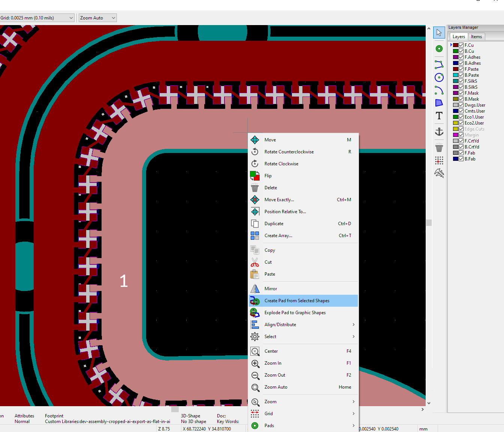

# Using Illustrator (and other vector drawing tools) with KiCad

## TL;DR
[Jump to the important bits](#gerbolyze-the-winning-solution)

## Why This Guide?
This outline is drawn from days of frustration trying to move a complicated set of vector art and traces into KiCad for final wiring and production.  

In defense of Adobe Illustrator: while it is not open source and has an associated monthly cost; it still sets the benchmark for WYSWYG vector graphics. It can read and write almost any vector file type and has numerous drawing tools that make doing deeply complex are much easier. Outside of the PCB/Open-Source Software Community Illustrator is widely used.

I wanted to do the following with my PCB:
- Plot arbitrary vector graphics on the silkscreen layer. Ideally; using native line widths rather than having to expand lines in illustrator.  
- Plot copper and soldermask to component-sized pads. This allowed me to use standard CAD tools to flow pads along splines.
- Plot exposed copper pours and soldermask as part of vector art.
- Do all of this with native vector art, without washing it through a raster first.  

**If you have significant experience or buy-in with Inkscape; I recommend the excellent [svg2shenzhen](https://github.com/badgeek/svg2shenzhen) project.**

Your mileage may vary, but I will share what did and didn't work.  

## A Bit About SVGs (More about SVGs than you ever wanted to know...)
SVGs are not all created equal. Illustrator and [Rhino](www.rhino3d.com) seem to be largely compatible in their handling of SVGs (although Rhino does not acknowle line width, which is odd). Inkscape very much *does NOT* treat these the same way.   
**SVGs cannot contain layers.** But instead contain groups (which can be mapped roughly from layers to groups when exporting from Rhino or Illustrator). Rhino treats these as native groups:


The group name is embedded in the SVG as the following:
```
<svg xmlns="http://www.w3.org/2000/svg" viewBox="0 0 1417.32 1417.32"><defs><style>.cls-1,.cls-5,.cls-6,.cls-7{fill:#231f20;}.cls-2{fill:#a5a4a4;}.cls-3,.cls-4{fill:#fff;}.cls-4,.cls-5{fill-rule:evenodd;}.cls-6{stroke:#231f20;}.cls-10,.cls-11,.cls-12,.cls-13,.cls-6,.cls-7,.cls-8,.cls-9{stroke-miterlimit:10;}.cls-6,.cls-7,.cls-9{stroke-width:0.75px;}.cls-10,.cls-11,.cls-12,.cls-7,.cls-8,.cls-9{stroke:#fff;}.cls-10,.cls-11,.cls-12,.cls-13,.cls-8,.cls-9{fill:none;}.cls-8{stroke-width:3px;}.cls-11{stroke-width:0.5px;}.cls-12{stroke-width:3.7px;}.cls-13{stroke:#a5a4a4;}</style></defs><g id="Black_Underlay" data-name="Black Underlay"><rect class="cls-1" width="1417.32" height="1417.32"/></g><g id="F.Cu"><polygon class="cls-2" points="136.95 478.91 118.42 478.91 84.5 445 39.28 445 39.28 475.15 84.5 475.15 114.65 505.3 136.95 505.3 136.95 478.91"/><polygon class="cls-2" points="364.76 552.62 291.78 478.91 148.88 478.91 148.88 505.3 281.42 505.3 347.31 570.74 364.76 552.62"/><path class="cls-2" d="M600.23,815.26a2.08,2.08,0,1,0-.26,2.63A1.77,1.77,0,0,0,600.23,815.26Z"/><path class="cls-2" d="M608.68,827c-.49-.34-1-.55-1.45-.08s-.21.91.18,1.29a1.42,1.42,0,0,0,2,.3l.64-.63A4.53,4.53,0,0,1,608.68,827Z"/><path class="cls-2" d=.........
```

This export was done through the below `Export for Screens` method from Adobe Illustrator (**Update:** Use `SaveAs` instead). Illustrator has changed the layers to groups i.e. `<g id="F.Cu">` represents the starting tag of a new group. 

After opening an SVG that was taken from Illustrators > Inkscape > Save as a new SVG the groups are lost. While they still exist in the SVG, there seem to be no members within each group. The artifact looks the following at the very end of the SVG:
```
...........
  <g
     inkscape:label="[fixed] BG"
     inkscape:groupmode="layer"
     sodipodi:insensitive="true"
     id="g16807">
    <rect
       x="0"
       y="0"
       width="500.0"
       height="500.0"
       style="fill:#FFFFFF;fill-opacity:1;stroke:none"
       id="rect16805" />
  </g>
  <g
     inkscape:label="F.Adhes"
     inkscape:groupmode="layer"
     id="g16809" />
  <g
     inkscape:label="Edge.Cuts"
     inkscape:groupmode="layer"
     id="g16811" />
  <g
     inkscape:label="B.Cu"
     inkscape:groupmode="layer"
     id="g16813" />
  <g
     inkscape:label="B.Mask"
     inkscape:groupmode="layer"
     id="g16815" />
  <g
     inkscape:label="B.SilkS"
     inkscape:groupmode="layer"
     id="g16817" />
  <g
     inkscape:label="F.Cu"
     inkscape:groupmode="layer"
     id="g16819" />
  <g
     inkscape:label="F.Mask"
     inkscape:groupmode="layer"
     id="g16821" />
  <g
     inkscape:label="F.Paste"
     inkscape:groupmode="layer"
     id="g16823" />
  <g
     inkscape:label="F.SilkS"
     inkscape:groupmode="layer"
     id="g16825" />
  <g
     inkscape:label="Dwgs.User"
     inkscape:groupmode="layer"
     id="g16827" />
  <g
     inkscape:label="Drill"
     inkscape:groupmode="layer"
     id="g16829" />
</svg>
```
So the groups are getting mangled somewhere in Inkscape.  
These group tags are key to the Gerbolyze process and must be maintained.

### A Bit MORE About SVGs
The more I dug into the below scaling issues with Illustrator, the more I had to dig into SVGs.  
The `ViewBox` attribute is key to understanding how SVGs work, although in this case it doesn't help.
For further reading I encourage you to read this [excellent article](https://css-tricks.com/scale-svg/).  

## Adobe Illustrator and SVGs
**Significant Update**
If any of the devs for SVG export for Illustrator ever read this....I have questions for you.....So many questions.

### Illustrator and SVGs Units
Illustrator seems to have no consistency in SVG units. They certainly don't correlate to any of the selected units in `Document Setup`.  
I've encountered Illustrator SVG exports in both Points, Inches, Pixels and no units specified. It **seems** to default to Points. It's frustrating.  
The units from `Document Settings` are embedded in the initial `width` and `height` tags, but nowhere else. Despite the call of a specific unit, the file itself will be in Points or px. Example of art this is 500x500mm with `Document Settings` set to mm:  
```
<svg xmlns="http://www.w3.org/2000/svg" width="500.35277mm" height="500.3528mm" viewBox="0 0 1418.3228 1418.3229">
<g id="Edge.Cuts">
    <rect class="cls-1" x="0.5" y="0.5" width="1417.3228" height="1417.3229"/>
```
So, in the above, it's defining the `width` and `height` in mm, but the viewbox (the artboard) is in Points. The Edge.Cuts box is also defined in points. **Changing the Document Settings units does nothing to change this**.

### Do Artboards Mattter?
**Yes.**  
Initially I thought they didn't but when you're scaling things around, the artboard is translated to the `viewbox` tag and is key going into Gerbolyze.  
Make your artboard the size of your PCB (after you scale it down, because Points to mm).

### Illustrator And The Three Ways Of Exporting SVGs
Illustrator can export SVGs in the following ways:
- `Export for Screens` (great, I guess, if you're doing a ton of artboards)
- `Export As` (Basically the same, just single-shot)
- `Save As` (**Totally not the same as the others**)

Export for Screens:


Export As:


Save As:


### Decimal Precision
In all the above dialogues you're prompted for the SVG precision (how much floating point accuracy you want).  
**Only `SaveAs` seems to accept a number larger than 5**  
This seems to be a bug, but it's annoying.  
I've been using 7 as my preferred export precision.  

### Compound Shapes
I've had a few instances where Gerboylze simply hangs, using 100 percent CPU, at the following dialogue:
```
copying svg input into temp svg
calling usvg on "/tmp/filei7vDix.svg" and "/tmp/filezsxHfy.svg"
parsed 0 vectorizers
Loading temporary file "/tmp/filezsxHfy.svg"
loaded viewbox: 0, 0, 500.003, 500.003
document viewbox clip: bbox={0, 0} - {5000031433, 5000031738}
Rejecting layer ""
Forwarding layer name to sink: "Edge.Cuts"
Setting S-Exp export layer to "Edge.Cuts"
Setting S-Exp export layer to ""
Forwarding layer name to sink: "F.Cu"
Setting S-Exp export layer to "F.Cu"
Setting S-Exp export layer to ""
Forwarding layer name to sink: "F.Mask"
Setting S-Exp export layer to "F.Mask"
Setting S-Exp export layer to ""
Forwarding layer name to sink: "F.SilkS"
Setting S-Exp export layer to "F.SilkS"
```
No amount of time makes it clear the jam. In practice, if it takes more than a few seconds, it has likely hung.  
After deleting sections of my art, exporting again, and testing, I determined that compound paths can cause trouble. I experiment by putting geometry on different layers, to isolate exactly which geometry was causing problems. It will happen on problem vectors on any layer, mine just happened to be on F.SilkS.
Deleting the path made Gerbolyze work just fine. Re-compounding the paths also worked. Not every compound path caused problems, just one. It was very strange.  
If you're having trouble with Gerbolyze hanging up:
- Try editing your compound paths
- Release your clipping masks
- Expand your live paint groups
- Make sure you set `Type` to `Convert to Outline` at SVG export  

Now back to our normal programming...
## What Are The Other Options?
I've used and tried the following to make arbitrary vector art PCBs.

### [CircuitMaker](circuitmaker.com)
- It is possible to do the following in CircuitMaker:
  - Convert vector art to SVG and import into a font creation tool like [Glyphter](www.glyphter.com) and create a vector TrueType font.
  - Install this font in windows  
  - Insert each layer (i.e. Top Copper, Top Mask, Top Silk) as a text object in CircuitMaker, specifying the correct font and letter, then assigning to the correct layer.

**The ability to import DWG/DXFs has been broken in CircuitMaker 2.0+. This seems to be the only option if you must use CircuitMaker**

**Pros**
- It worked. With patience this was a workable solution in CircuitMaker, since their DWG import was never particularly good.

**Cons**
- Complex vector art falls apart quickly. I don't know if this is due to Glyphter or limitations within TrueType
- A non-linked workflow. You have to re-generate the font every single time and update the installation
- Aligning layers can be tricky
- Scale is relatively arbitrary. It is not easy (or really possible) to make something a precise scale

### [Altium Designer](www.altium.com)
- Version used is 25.5.1
- Altium has a reasonably comprehensive DWG/DXF import tool that can bring in multiple layers in a single import. **Altium only supports AutoCAD DWG format 2013 and below**.  
In my limited testing I've found the following:

**Pros**
- None. Does not yet work. (See Cons)

**Cons**
- Line thicknesses but be expanded in Illustrator pre-export. This is annoying and deeply manual.
- Fills and hatches seem inconsistent and do not yeild easily to attempts at repair.
- Altium is quite expensive (~$3,000/seat/year)

## [KiCad](www.kicad.org) Methods
As with a lot of software, there is more than one way to skin a cat (just a phrase. I love cats). I will outline all the methods I tried that **didn't** work in addition to the final one that did. 

### KiCad Convert Image Tool

This is KiCad's built-in method for converting raster art to footprints and logos. It produces a `kicad_mod` file that can be placed in a custom library.

**Limitations**
- **This tool will not place an object onto the copper, paste or mask layers** (this rules it out for what I want to do)
- It is DPI dependent, rely on rasters for input. For a large board you will end up with inaccuracies or lost detail.
- This is what you end up with, for large and detailed artwork: 
- It should look like: 

### [SVG Path to Kicad Online](http://kicad.feldoncentral.com/svg2kicad/svg2kicad.php)
I tried this but couldn't make it work with SVGs coming out of Illustrator, due to Illustrator and Inkscape having very different ideas about how to handle SVGs.

### [img2mod](http://img2mod.wayneandlayne.com/)
This is a web-based tool for converting small raster images to kicad_mod files. 
While it looks simple and like it could be a good solution for small rasters (like QR codes) it fell flat for the work I'm trying to do.  

**Limitations**
- Raster input
- Unclear how large a file you can throw at it

### [PCBmodE](https://boldport.com/pcbmode)
PCBmodE is a fully featured PCB design suite (although I haven't spent any time using it yet) that looks to have promising possibilities.  
Kudos to the PCBmodE team for maitaining an open source project.

I didn't fully explore this option because it seemed to rely on Inkscape SVGs. Specifically in [their workflow page](https://pcbmode.readthedocs.io/en/latest/layer-control.html) they reference using Layers in Inkscape. I've not yet found a good way to automatically manage these. Again, since SVGs don't *have* layers, Inkscape's implementation of layers seems strange.

**Limitations**
Reliant on Inkscape's layers, which are a pain/somewhat-impossible to transfer easily from Illustrator.

### [Plugin SVG2Shenzhen](https://github.com/badgeek/svg2shenzhen)
As stated above, if you have deep knowledge of Inkscape, or the majority of your art is native to it, this tool could work well for you. In my testing, I discovered a few subtle but show-stopping problems.

**Method**
- This *can* work but it's a pain and requires a lot of refactoring. 
- Export an SVG from Illustrator
- Open in Inkscape
- *Or* Save document as an .ai file
- Open in Inscape (I have not found a way to convey layers, or any other meaningful organizational structure from Illustrator into Inkscape. Please tell me if you've found a better way)
- Use the `prepare document` command from the `svg2shenzhen` plugin menu. This will create layer names with the correct KiCad sytax.
- Move your art onto the correct layers (possibly use color groups to select objects colors)
- Export from the plug-in. I've had this take many many minutes and then end up with poorly rasterized artwork. 

**Limitations**
- **Not all SVGs are the same**
  - The SVGs that Inkscape uses aren't the same as other SVGs. Groups, et al do not convey from Illustrator.
- A lot of steps and not linked in any meaningful sense.
- **VERY SLOW** Since it's rasterizing the artwork, regardless of the native vector source

## [Gerbolyze (the winning solution)](https://github.com/jaseg/gerbolyze)
Is it pronounced "gerb-oh-lyze" or "gerbil-ize"? We'll never know...

Gerobylze is a very capable python tool which can deal with both raster and vector art and convert it into either SVGs, gerbers or Ki-cad mod files. 

My artwork has been native vector, so I'm not using the more advanced raster -> vector features, but they're very comprehensive. Kudos to @jaseg! (Some of the rasterization techniques look similar to [Rasterbater](https://rasterbator.net/) a tool I used in college)

### Installation
Gerboylze requires Python and a few dependencies. I ended up installing it on a Raspberry Pi 4 that was handy. I have also run it on an Ubuntu VM
Follow your OS-specific instructions on [Gerbolyze Website](https://github.com/jaseg/gerbolyze#quick-start-installation)

**NOTE on Ubuntu Installs:**
I installed per Gerboylyze's Ubuntu instructions in an Ubuntu 20.04 VM.  
Missing from their documentation:
- Gerbolyze installs to `~/.local/bin` by default. It can be run with `./.local/bin/gerbolyze`
- To add it to the PATH directory using `export PATH=~/.local/bin=$PATH` then you can run it from anywhere using `gerbolyze`

**Compiling from source:**
I had to run the following commmands to compile from source in Ubuntu 20.04 in a venv:
```
git clone --recurse-submodules https://git.jaseg.de/gerbolyze.git
cd gerbolyze

pip3 install --user git+https://git.jaseg.de/pcb-tools-extension.git
python3 -m venv /path/to/venv
source /path/to/vm/bin/activate

pip3 install pcb-tools-extension
pip3 install click
pip3 install lxml
pip3 insall numpy

python3 setup.py install
```
(Author's Note: Yay submodules!)


### Method
- Prep layer names in illustrator 
  - Unless you're using the the `-sexp-layer` switch (which will take the entire SVG and put it on one PCB layer)
  - You **MUST** change the layer names in Illustrator before you save it to an SVG using the `Save As` function, otherwise group/layer names will not work well. This seems to be a feature/bug within Illustrator.
  - | Illustrator Layer Name (**Case Sensitive**) |                           Functional Name                          |
	|:----------------------:|:------------------------------------------------------------------:|
	|          F.Cu          |              Front Copper (Top Layer in Altium-speak)              |
	|          B.Cu          |                 Back Copper (Back Layer in Alitum)                 |
	|         F.Paste        |                          Front Paste Mask                          |
	|         B.Paste        |                           Back Paste Mask                          |
	|         F.SilkS        |                Front Silk (Front Overlay in Altium)                |
	|         B.SilkS        |                      Back Silk (Back Overlay)                      |
	|         F.Mask         | Front Solder Mask (remove this if you want copper to show through) |
	|         B.Mask         |                          Back Solder Mask                          |
	|         F.CrtYd        |                            Front Courtyard                         |
	|         B.CrtYd        |                            Back Courtyard                          |
	|         Dwgs.User      |     User Drawings (super useful to keeping track of LED numbers    |
	|        Cmts.User       |                             User Comments                          |
	|        Edge.Cuts       |                    Edge Cuts (Outline in Altium)                   |
  - You can have additional layer names, but they will be ignored (as long as the `-sexp-layer` isn't thrown). 
- Your Illustrator layer panel should look something like this:
  , and you don't need to `Expand` all artwork
- The artwork should be no stroke color and no stroke weight.
- You must have a fill color, since there's no stroke. When you highlight the art, it must NOT look like this: 
- If you have artwork that has neither a stroke nor fill (which is possible in Illustrator) you'll likely get an error like this in Gerbolyze: `Warning: clear polarity not supported since KiCAD manages to have an even worse graphics model than gerber, except it can't excuse itself by its age..... -.-`  
- You may use clipping masks if exporting a smaller section of larger art. These are baked during the SVG conversion, so Gerbolyzer doesn't see any difference. (Author's Note: Clipping masks are both great and terrible)

### Scaling Artwork Before Export
See above about how Illustrator deals with SVG scale. 
You **MUST** do the following before proceeding to the export step:
- Select all vectors
- `Object > Transform > Scale` with a scale factor of 35.278% (Illustrator won't accept a fourth decimal place). This number is: Points to mm conversion.
- Then re-adjust the artboard to match your `Edge.Cuts` layer. 


### About `Export for Screens` (And Why You Should Use SaveAs Instead)
- While normally `Export for Screens` in Illustrator is an excellent way to keep track of your artboards, and multiple exports. I've found, in cases of complex graphics, that it does offer enough control over the output. 
- **Update, this still applies** On complex artwork (roughly 1MB or larger, anecdotally) `Export for Screens` creates very strange artifacts:

(this was exported from Illustrator using `Export for Screens` then opened in Rhino for clarity. It loads in Gerbolyze the same way.

**Update**
Use the following to have high-decimal control over your SVG export. 
- `File > SaveAs` then select SVG:

- You should then have the following options:

Pick:
- `SVG Profile`: `SVG 1.1`
- `Type`: `Convert to Outline`
- `Preserve Illustrator Editing Capabilities` unticked. I'm not entirely sure what this does.
- `Decimal Places`: `7` 
- `Responsive`: `No`

- Another Note: If must set all layers to visible. If they're not visible, they will still be exported, but Gerbolyze won't read them.

- After running with 5 decimal places of export through `Export As` I created an SVG that looks much better:

	
### Now, continuing our journey....
- Remember to un-scale your art in Illustrator so that everything isn't permanently the wrong size when you save.
- Transfer the resulting SVG via sFTP or similar to your VM or Raspi
- Run `svg-flatten --format kicad --sexp-mod-name TestModule3 --no-flatten /home/pi/name_of_svg.svg /home/pi/name_of_kidcad_file.kicad_mod`
  - Explanation:
    - `--format kicad` specifies that you'd like the resultant file in kicad_mod type
	- `--sexp-mod-name` specifies the module reference in KiCad. This seems like it can be arbitrary and not globally unique, but **must** be specified. For manifestation in KiCad see: 
	- `--no-flatten` this disables the flattening algorithm. This is largely similar to doing the `Pathfinder > Union` command in Illustrator or the `booleancurve` command in Rhino. **When this flag wasn't thrown, svg-flatten` would run but produce a 1k file containing  nothing.** Through anecdotal testing in KiCad, it seems that even un-unioned artwork imports well. 
	  - Un-unioned art in Illustrator: 
	  - Imported through this process to KiCad. It has created the same overlapping areas on layer `F.SilkS`. Most fab shops should be fine with this overlap: 
	- You could always union the artwork in pre-processing.
- Now that we have the resultant `myfile.kidcad_mod` file, transfer it back to your working KiCad directory.
- Add this as a custom footprint location per [directions from KiCad](https://forum.kicad.info/t/library-management-in-kicad-version-5/14636)
- Place the footprint in PCBnew and admire your gorgeous vectors: 
- Additional Bonus:
  - The lines drawn in Illustrator convey their width without having to be expanded.
  - In Illustrator 
  - And now in KiCad 

### Adding Pad Designators
- Now that we have our layer-sorted vectors in KiCad, open footprint editor
- Add an SMT pad to "anchor" (KiCad's terminology) each copper island. These should be directly overlapping. **You must have one pad per isolated copper if you want to assign it a pin number**
- Like this:

- Now select both the pad and the imported are, right click and press `Create Pad from Selected Shapes` like this:

- Now we can use our normal fill and intelligently merge copper areas like this (note: selecting pads vs whole components can be a pain for oddly shaped components):


